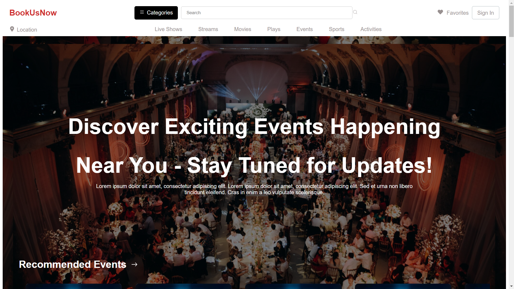
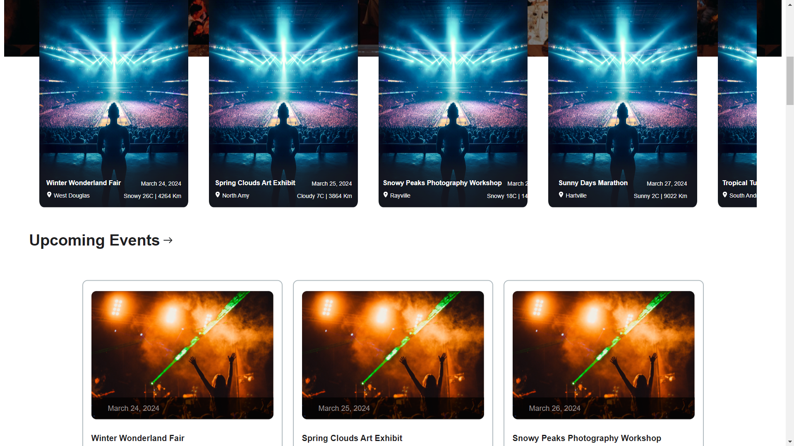
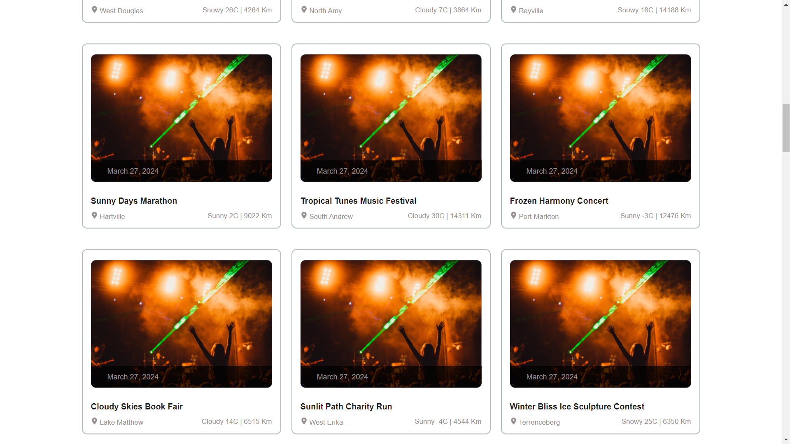

# Frontend Developer Internship Assignment

## Live Site
[Live Site Demo](https://book-us-now-theta.vercel.app/)

## Website Preview



## GitHub Repository
[GitHub Repository](https://github.com/dhruv-g04/BookUsNow)

## Project Overview
This project aims to build a responsive website for displaying upcoming and recommended events. It fetches events from provided APIs and displays them in a user-friendly manner. The website is designed to work seamlessly on both desktop and mobile screens.

## Setup and Local Run Instructions
To run the project locally, follow these steps:

#### 1. Clone the Repository
```bash
git clone https://github.com/dhruv-g04/BookUsNow
```
#### 2. Requirements
Ensure you have the following requirements installed:

- Node.js
- React
- Other dependencies specified in the project's package.json file

#### 3. Dependencies
- react-icons: For including icons in the project

#### 4. Run
Navigate to the project directory and run the following commands:

```bash
npm install
npm install react-icon
npm start
```
## Explanation of Design 
- Responsiveness: The website is designed to adapt to various screen sizes, providing an optimal viewing experience on both desktop and mobile devices.
- API Integration: Data from the provided APIs is fetched and displayed efficiently, ensuring seamless integration and real-time updates.
- Horizontal Scrolling: Recommended events are displayed in a horizontally scrollable container, allowing users to easily browse through the events.
- Lazy Loading: Upcoming events are fetched page by page, with the next page being loaded from the API only when the user scrolls to the end of the page. This ensures optimal performance and reduces unnecessary data fetching.
-CSS Styling: The project utilizes the specified color scheme and fonts (Font - Inter, Font color - #1E2022, Background color - #ffffff, etc.) to maintain visual consistency and adhere to design guidelines.

## Technical Issues Encountered and Decisions Made
- Lazy Loading Implementation: Implementing lazy loading for fetching upcoming events posed technical challenges due to the asynchronous nature of data fetching and rendering. To overcome this, an IntersectionObserver was used to detect when the user scrolls to the end of the page and trigger the fetching of the next page of events.
- Data Requirements: Some required information for events, such as card size, was not provided in the initial project requirements. To address this, assumptions were made based on industry standards and best practices. Additionally, any missing information was communicated to stakeholders for clarification and adjustments were made accordingly.

## Contributors
[Dhruv Gupta](https://github.com/dhruv-g04)
